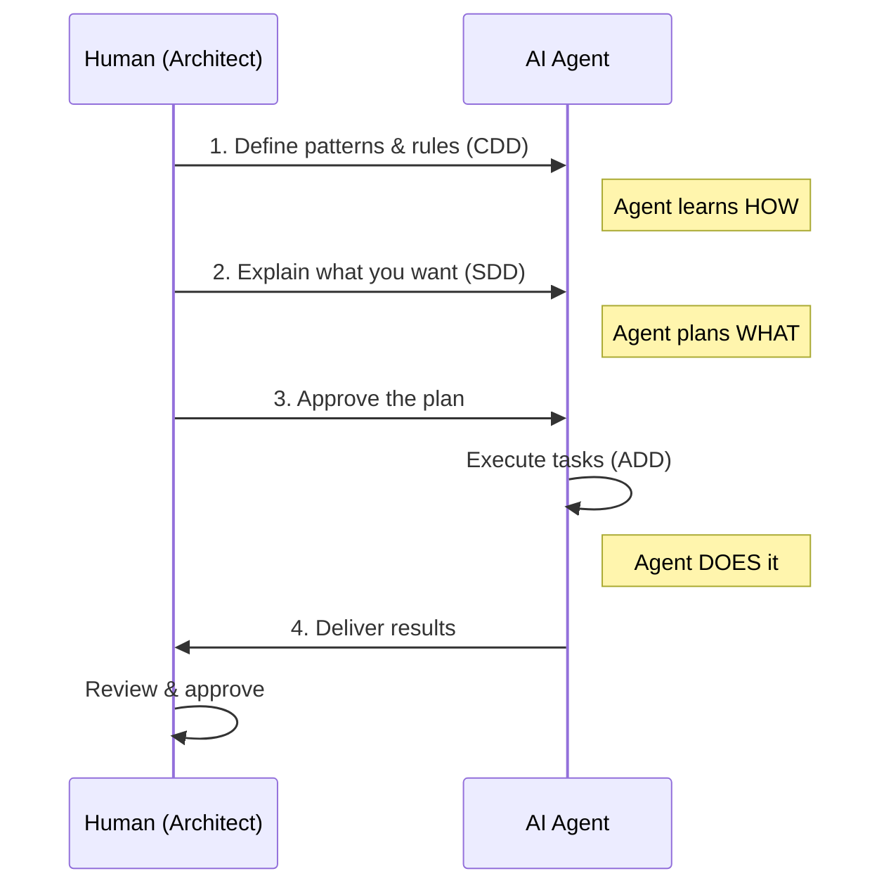

# Agentic Development Protocol

> A methodology for LLM-driven software development

## What is This?

The Agentic Development Protocol defines how humans and AI agents collaborate to build software. It consists of three interconnected methodologies:

| Methodology | Purpose | Key Idea |
|-------------|---------|----------|
| **CDD** | Context-Driven Development | How agents understand your project |
| **SDD** | Spec-Driven Development | How you plan what to build |
| **ADD** | Agent-Driven Development | How agents execute your plans |

## The Big Picture

## How It Works

### Step 1: Set Up Context (CDD)

You organize project knowledge so agents can find what they need:

- `.ai/` - Quick pointers (agent reads this first)
- `docs/llm/` - Detailed rules and patterns
- `.specs/` - Task specifications

### Step 2: Plan Your Work (SDD)

Instead of writing code, you explain what you want:

1. **Roadmap**: "I'm building a todo app with React and Python"
2. **Scope**: "First, let's do basic CRUD operations"
3. **Tasks**: Agent generates detailed task list, you approve

### Step 3: Let Agent Execute (ADD)

Once you approve the plan:

1. Agent implements each task
2. Agent updates documentation (CDD)
3. Agent archives completed work
4. You review the final result

## Why This Approach?

| Traditional | Agentic Protocol |
|-------------|------------------|
| You write code | Agent writes code |
| You debug issues | Agent debugs first |
| You write docs | Agent writes docs |
| You manage details | You set direction |

**Your role**: Architect - set direction, review, approve

**Agent's role**: Implementer - plan, code, document, iterate

## Getting Started

1. Read [CDD](./cdd.md) to understand context management
2. Read [SDD](./sdd.md) to learn planning workflow
3. Read [ADD](./add.md) to understand execution

## Quick Reference

| I want to... | Read |
|--------------|------|
| Organize project for agents | [CDD](./cdd.md) |
| Plan a new feature | [SDD](./sdd.md) |
| Understand agent execution | [ADD](./add.md) |
