# ADD: Agent-Driven Development

> How AI agents execute your approved plans

## The Problem

You've planned the work (SDD). Now what?

Traditional approach:
- You implement each task
- You debug issues
- You write documentation
- You manage all the details

**ADD solves this** by letting agents handle execution while you supervise.

## Core Concept

```mermaid
flowchart TD
    A["✅ Approved SDD Tasks"] --> B["🤖 Agent executes autonomously"]
    B --> C["📚 Agent updates CDD"]
    C --> D["📦 Agent archives work"]
    D --> E["🧑 You review results"]
```



**Your job**: Approve and review
**Agent's job**: Execute everything

## The Execution Flow

### 1. Entry Point

When you tell an agent to work on your project:

```mermaid
flowchart TD
    A["📖 Read AGENTS.md<br/>(shared rules)"] --> B["📖 Read .ai/README.md<br/>(project context)"]
    B --> C["📖 Check .specs/{app}/roadmap.md"]
    C --> D["🔍 Find relevant tasks"]
    D --> E["🔨 Implement"]
```



### 2. Spec-First Validation

Before implementing anything, agents verify a spec exists:

```mermaid
flowchart TD
    A["🧑 You: 'Implement user authentication'"] --> B["🔍 Agent searches .specs/"]
    B --> C{"Found?"}
    C -->|"✅ Yes"| D["📖 Read tasks → 🔨 Implement"]
    C -->|"❌ No"| E["⚠️ Ask: Create spec first?"]
    E --> F["1. Create spec (Recommended)"]
    E --> G["2. Implement directly"]
```



This prevents random coding without a plan.

### 3. Task Execution

Agents work through tasks systematically:

```mermaid
flowchart TD
    A["📖 Read tasks/2026-S1/index.md"] --> B["🔍 Identify ready tasks"]
    B --> C["📖 Read task file"]
    C --> D["🔨 Implement steps"]
    D --> E["✅ Run verification"]
    E --> F["☑️ Mark complete"]
    F --> G{"More tasks?"}
    G -->|"Yes"| B
    G -->|"No"| H["🎉 All done!"]
```



### Progress Tracking

Agents update task status as they work:

```markdown
## Task List
| # | Task | Status |
|---|------|--------|
| 01 | Backend auth | [x] Complete |
| 02 | Frontend auth | [x] Complete |
| 03 | Backend CRUD | [ ] In Progress |
| 04 | Frontend CRUD | [ ] Blocked |
```

## Execution Modes

### Single Agent

One agent handles all tasks sequentially:

```mermaid
flowchart LR
    A["🧑 You"] --> B["🤖 Agent"]
    B --> C["Task 1"] --> D["Task 2"] --> E["Task 3"] --> F["✅ Done"]
```



Best for: Small projects, simple dependencies

### Multi-Agent (Parallel)

Multiple agents work simultaneously:

```mermaid
flowchart LR
    O["🎯 Orchestrator"] --> A["🤖 Agent A"]
    O --> B["🤖 Agent B"]
    O --> C["🤖 Agent C"]
    A --> T1["Task 1"]
    B --> T2["Task 2"]
    C --> T3["Task 3"]
    T1 --> M["🔀 Merge"]
    T2 --> M
    T3 --> M
```



Best for: Large projects, independent tasks

### Git Worktree (Isolated Parallel)

Each agent works in separate git worktree:

```bash
# Setup
git worktree add ../project-task-a -b feat/task-a
git worktree add ../project-task-b -b feat/task-b

# Agents work in isolation
# Merge when all complete
```

Best for: Complex changes that might conflict

## Self-Resolution Protocol

Agents try to solve problems before asking you:

### Step 1: Self-Resolution

Agent encounters a problem:

```mermaid
flowchart TD
    A["❌ Problem: Test failing"] --> B["🤖 Agent tries self-resolution"]
    B --> C["1. Re-read CDD rules"]
    B --> D["2. Search codebase"]
    B --> E["3. Run tests with detail"]
    B --> F["4. Check documentation"]
    C & D & E & F --> G{"Resolved?"}
    G -->|"✅ Yes"| H["Continue"]
    G -->|"❌ No"| I["Step 2: Peer Consensus"]
```



### Step 2: Peer Consensus (Multi-Agent)

If self-resolution fails and multiple agents are available:

```mermaid
flowchart TD
    A["🤖 Agent A: 'Fix is X'"] --> D{"Consensus?"}
    B["🤖 Agent B: 'Agree, X correct'"] --> D
    C["🤖 Agent C: 'Confirmed, follows patterns'"] --> D
    D -->|"✅ Reached"| E["Apply fix X"]
    D -->|"❌ Failed"| F["Step 3: Human Escalation"]
```



### Step 3: Human Escalation

If consensus fails or single agent can't resolve:

```
Agent creates incident report:

## Incident: Test Failure in Auth Module

### Problem
OAuth callback returns 500 error

### Attempted Solutions
1. Checked credentials - Valid
2. Checked callback URL - Correct
3. Searched codebase - No similar pattern

### Options
1. Use mock OAuth for development
2. Switch to different OAuth provider
3. Debug with production credentials

### Decision Required
Which approach should I take?
```

You respond, agent continues.

## Human Intervention

When you need to intervene:

### What You Do

1. **Review** the incident report
2. **Identify** root cause
3. **Update** the appropriate layer:
   - Missing pattern? Update CDD
   - Unclear requirement? Update SDD
4. **Restart** the agent

### What You DON'T Do

- Write implementation code
- Debug routine issues
- Handle tasks the agent can do

```
Agent: "I can't find the database connection pattern"

You (Good): Update docs/llm/guides/database.md with pattern
You (Bad): Write the database connection code yourself
```

## Experience Capitalization

**Critical**: After completing tasks, agents MUST update CDD.

### Mandatory Updates

| Tier | What to Update | Example |
|------|----------------|---------|
| T1 (.ai/) | Add pointer to new service | `services/auth.md` |
| T2 (docs/llm/) | Add patterns learned | `guides/oauth.md` |

### The Flow

```mermaid
flowchart TD
    A["✅ All tasks complete"] --> B["🔍 Identify new patterns"]
    B --> C["📝 Update .ai/ (T1 pointers)"]
    C --> D["📚 Update docs/llm/ (T2 rules)"]
    D --> E["📦 Archive to history/"]
    E --> F["🎉 Work complete!"]
```



### Example

After implementing OAuth:

**.ai/services/auth.md** (new file):
```markdown
# Auth Service

Location: services/api/auth/
Patterns: docs/llm/guides/auth.md
```

**docs/llm/guides/auth.md** (updated):
```markdown
## OAuth Patterns

| Provider | Flow | Callback |
|----------|------|----------|
| Google | Authorization Code | /auth/google/callback |
```

## Verification Checklist

Before marking work complete, agents verify:

- [ ] All task steps complete
- [ ] Tests pass
- [ ] Lint passes
- [ ] Build succeeds
- [ ] Spec tasks checked off
- [ ] CDD Tier 1 updated (if new patterns)
- [ ] CDD Tier 2 updated (if new rules)
- [ ] Completed tasks archived to history/

## Agent Configuration

### AGENTS.md (Shared)

Every project should have an `AGENTS.md` that all agents read:

```markdown
# Agent Instructions

## Entry Point
1. Read .ai/README.md
2. Check .specs/{app}/roadmap.md

## Rules
- Never commit directly to main
- Always check spec before implementing
- Update CDD after completing tasks

## Workflows
| Action | Guide |
|--------|-------|
| Implement | .ai/workflows/implementation.md |
| Review | .ai/workflows/review.md |
```

### Tool-Specific Files (Optional)

You can create tool-specific instructions:

**CLAUDE.md**:
```markdown
# Claude Configuration
Default model: claude-sonnet-4-20250514
Complex tasks: claude-opus-4-20250514
```

**GEMINI.md**:
```markdown
# Gemini Configuration
Default model: gemini-2.0-flash
```

## Best Practices

### 1. Spec First

Always ensure a spec exists before implementation:

```
You: "Add user profiles"
Agent: "[!] No spec found. Create spec first?"
You: "Yes, create the spec"
```

### 2. Small Verifiable Steps

Tasks should be small enough to verify:

Bad: "Implement entire authentication system"
Good: "Implement OAuth callback endpoint"

### 3. Update Progress

Agents should mark tasks as they complete:

```markdown
- [x] Create auth module
- [x] Add OAuth dependencies
- [ ] Implement callback (in progress)
- [ ] Add tests
```

### 4. Always Capitalize

Never skip the CDD update step:

```
Complete task --> Update CDD --> Archive

NOT:

Complete task --> Archive (skipping CDD update)
```

### 5. Human Gates

Complex or risky changes should pause for review:

```
Agent: "I've implemented the payment integration.
        This touches billing logic.
        Please review before I continue."
```

## Summary

| Phase | Who | Does What |
|-------|-----|-----------|
| Execution | Agent | Implements approved tasks |
| Problem-solving | Agent | Tries self-resolution first |
| Escalation | Agent | Creates incident report |
| Intervention | Human | Updates CDD/SDD, restarts |
| Capitalization | Agent | Updates CDD, archives |
| Review | Human | Verifies final result |

**Key principle**: Agents implement, humans approve.
