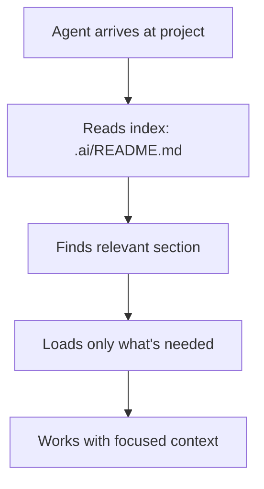
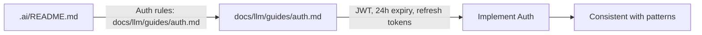
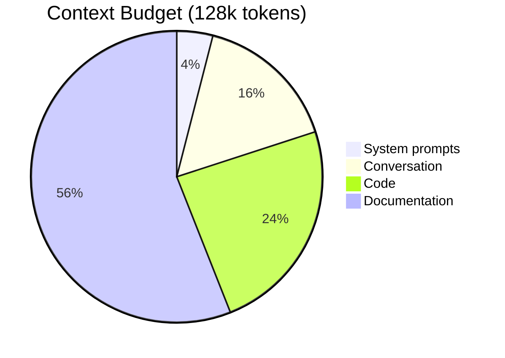

# CDD: Context-Driven Development

> How to organize project knowledge for AI agents

## The Problem

AI agents have limited "memory" (context window). If you dump everything at once, they:
- Forget important rules
- Miss critical patterns
- Make inconsistent decisions

**CDD solves this** by organizing knowledge in layers that agents load on-demand.

## Core Concept

Think of CDD as a **library system** for your project:



## The 4-Tier Structure

### Tier 1: Quick Pointers (`.ai/`)

**Purpose**: Agent's first stop - tells them where to find things

**Rules**:
- Maximum 50 lines per file
- Contains pointers, not full content
- Always loaded first

**Example** `.ai/README.md`:
```markdown
# Project Context

## Quick Start
- Tech: React + Python FastAPI
- Specs: .specs/todo-app/

## Find More
| Topic | Location |
|-------|----------|
| API patterns | docs/llm/guides/api.md |
| Auth rules | docs/llm/guides/auth.md |
```

### Tier 2: Detailed Rules (`docs/llm/`)

**Purpose**: The "source of truth" for all patterns and rules

**Rules**:
- Maximum 300 lines per file
- Token-optimized format (tables, minimal prose)
- Contains actual rules, not duplicates

**Structure**:
```
docs/llm/
  policies/     # Development methodology
  guides/       # How to do things
  references/   # Technical specifications
```

### Tier 3: Human Documentation (`docs/en/`)

**Purpose**: Human-readable versions (you're reading this now!)

**Rules**:
- No line limits
- Generated from Tier 2
- Full explanations and examples

### Tier 4: Translations (`docs/{locale}/`)

**Purpose**: Localized documentation

**Rules**:
- Translated from Tier 3
- Same structure as `docs/en/`

## How Agents Use This

### Loading Strategy

Agents don't load everything. They follow this pattern:

| Situation | What Agent Loads |
|-----------|------------------|
| Starting work | `.ai/README.md` only |
| Finding a topic | Index file for that area |
| Deep work | Specific file needed |
| Implementation | CDD + relevant SDD spec |

### Example: Agent Implementing Auth



## Token Budget

Agents have ~128k tokens of context. Here's how to budget:



Within the documentation budget (70k), aim for **40% utilization** (~28k tokens). This leaves room for code context and conversation growth.

## Writing for Agents

### Do This (Token Efficient)

```markdown
## Auth Rules

| Rule | Value |
|------|-------|
| Token type | JWT |
| Expiry | 24 hours |
| Refresh | Yes |
```

### Not This (Token Heavy)

```markdown
## Authentication Rules

When implementing authentication in this project, you should
always use JSON Web Tokens (JWT) as our standard token format.
The tokens should expire after 24 hours to balance security
with user experience. We also support refresh tokens to allow
users to stay logged in without re-entering credentials.
```

The table version uses ~50% fewer tokens and is easier for agents to parse.

## ASCII-Only Rule (Tier 1 & 2)

To maximize compatibility and minimize tokens, Tier 1 and Tier 2 files must use ASCII only:

| Instead of | Use |
|------------|-----|
| Arrow symbols | `->`, `<-` |
| Box drawing | `+`, `-`, `\|` |
| Check marks | `[x]`, `[ ]` |
| Emojis | `[!]`, `[i]`, `[?]` |

## Best Practices

### 1. Index Everything

Every directory should have an `index.md`:

```markdown
# Guides Index

| Guide | Path | Topics |
|-------|------|--------|
| API | api.md | REST, endpoints |
| Auth | auth.md | JWT, sessions |
```

### 2. Single Source of Truth

Never duplicate information:
- Define a rule in ONE place
- Other places point to it
- Updates happen in one location

### 3. Keep Tier 1 Minimal

`.ai/` files should be signposts, not encyclopedias:

```markdown
# Good: Pointer
Auth patterns: docs/llm/guides/auth.md

# Bad: Full content in .ai/
## Auth Patterns
Use JWT with 24h expiry...
(100 more lines)
```

### 4. Update After Every Task

When you complete work that establishes new patterns:

1. Add pointer to `.ai/` (Tier 1)
2. Add rules to `docs/llm/` (Tier 2)
3. Generate human docs (Tier 3) if needed

## Summary

| Tier | Location | For | Max Lines |
|------|----------|-----|-----------|
| 1 | `.ai/` | Agent quick reference | 50 |
| 2 | `docs/llm/` | Agent detailed rules | 300 |
| 3 | `docs/en/` | Human reading | No limit |
| 4 | `docs/{locale}/` | Translations | No limit |

**Key principle**: More value per token. Organize so agents load only what they need, when they need it.
