# SDD: Spec-Driven Development

> How to plan work for AI agents to execute

## The Problem

If you just say "build me a todo app," you'll get:
- Inconsistent architecture
- Missing requirements
- Rework and confusion

**SDD solves this** by creating a clear planning workflow where you explain and the agent documents.

## Core Concept


**Your job**: Explain and approve
**Agent's job**: Write everything

## The 3-Layer Structure

### Layer 1: Roadmap

**What it is**: The big picture of your application

**You say**:
> "I'm building a todo app. React frontend, Python FastAPI backend.
> Users can create, edit, delete todos. Need authentication."

**Agent creates** `.specs/todo-app/roadmap.md`:
```markdown
# Roadmap: Todo App

## Tech Stack
| Layer | Technology | Location |
|-------|------------|----------|
| Frontend | React 19 | apps/web |
| Backend | Python FastAPI | services/api |
| Database | PostgreSQL | - |

## Features
| Feature | Priority | Status |
|---------|----------|--------|
| User auth | P0 | Planned |
| CRUD todos | P0 | Planned |
| Categories | P1 | Planned |

## Scopes
| Scope | Features | Target |
|-------|----------|--------|
| 2026-S1 | Auth + CRUD | Q1 |
| 2026-S2 | Categories | Q2 |
```

### Layer 2: Scope

**What it is**: A focused chunk of work (like a sprint)

**You say**:
> "Let's start with scope 1. Focus on Google OAuth first,
> then basic CRUD. Keep it simple."

**Agent creates** `.specs/todo-app/scopes/2026-S1.md`:
```markdown
# Scope: 2026-S1

## Direction
Focus on Google OAuth first, then basic CRUD. Keep it simple.

## Goals
- Google OAuth authentication
- Create, read, update, delete todos
- Simple UI, no fancy features

## Priority
1. Google OAuth (backend + frontend)
2. Todo CRUD API
3. Todo UI components
```

### Layer 3: Tasks

**What it is**: Detailed implementation plan

**You say**:
> "Plan the tasks. Backend and frontend can be parallel,
> then integration at the end."

**Agent creates** task files in `.specs/todo-app/tasks/2026-S1/`:

**index.md** (overview):
```markdown
# Tasks: 2026-S1

## Status
| Total | Done | In Progress | Pending |
|-------|------|-------------|---------|
| 6 | 0 | 0 | 6 |

## Dependencies


## Task List
| # | Task | Target | Depends | Status |
|---|------|--------|---------|--------|
| 01 | Backend auth | services/api | - | Pending |
| 02 | Frontend auth | apps/web | - | Pending |
| 03 | Backend CRUD | services/api | - | Pending |
| 04 | Frontend CRUD | apps/web | 01,02,03 | Blocked |
| 05 | CDD update | docs/ | 04 | Blocked |
| 06 | Archive | .specs/ | 05 | Blocked |
```

**01-backend-auth.md** (detailed task):
```markdown
# Task 01: Backend Authentication

> Target: services/api/

## Steps

### Phase 1: Setup
- [ ] Create auth module structure
- [ ] Add Google OAuth dependencies
- [ ] Configure environment variables

### Phase 2: Implementation
- [ ] Implement Google OAuth flow
- [ ] Create JWT token generation
- [ ] Add protected route middleware

### Phase 3: Testing
- [ ] Unit tests for auth logic
- [ ] Integration tests for OAuth flow

## Verification
```bash
cd services/api && pytest tests/auth/
```

## Done Criteria
- [ ] All steps complete
- [ ] Tests pass
- [ ] Code reviewed
```

## The Workflow

### Complete Flow

```mermaid
flowchart TD
    subgraph "📋 1. ROADMAP"
        R1["🧑 You: 'Building X with Y...'"]
        R2["🤖 Agent: Creates roadmap.md"]
        R3{"🧑 Review"}
        R1 --> R2 --> R3
        R3 -->|"✅ Approved"| S1
        R3 -->|"🔄 Change Z"| R2
    end

    subgraph "🎯 2. SCOPE"
        S1["🧑 You: 'First scope focuses on...'"]
        S2["🤖 Agent: Creates scope.md"]
        S3{"🧑 Review"}
        S1 --> S2 --> S3
        S3 -->|"✅ Approved"| T1
        S3 -->|"🔄 Change Z"| S2
    end

    subgraph "📝 3. TASKS"
        T1["🧑 You: 'Plan the tasks...'"]
        T2["🤖 Agent: Creates tasks/*.md"]
        T3{"🧑 Review"}
        T1 --> T2 --> T3
        T3 -->|"✅ Approved"| E1
        T3 -->|"🔄 Change Z"| T2
    end

    subgraph "🚀 4. EXECUTE (ADD)"
        E1["🤖 Implements all tasks"]
        E2["🤖 Updates CDD"]
        E3["🤖 Archives work"]
        E1 --> E2 --> E3
    end
```



### Decision Points

At each layer, you can:

| Response | What Happens |
|----------|--------------|
| "Approved" | Move to next layer |
| "Change X" | Agent revises |
| "Cancel" | Work is archived |

## Important Rules

### 1. You Never Write

Your role is to **explain**, not write:

| Do This | Not This |
|---------|----------|
| "We need user auth with Google" | Writing auth.md yourself |
| "Change the priority order" | Editing the spec file |
| "Add error handling" | Writing the code |

### 2. Tasks Include Documentation

Every scope's tasks must include:

```mermaid
flowchart LR
    A["🔨 Implementation tasks<br/>(01, 02, 03...)"] --> B["📚 CDD Update task<br/>(updates .ai/ and docs/llm/)"]
    B --> C["📦 Archive task<br/>(moves to history/)"]
```



This ensures knowledge is captured after every piece of work.

### 3. Agent Determines Locations

You describe WHAT, agent figures out WHERE from the roadmap:

| You Say | Agent Reads | Agent Implements In |
|---------|-------------|---------------------|
| "Backend auth" | roadmap.md Tech Stack | services/api/ |
| "Frontend components" | roadmap.md Tech Stack | apps/web/ |

### 4. Failure Handling

When something fails:

```mermaid
flowchart TD
    A["❌ Failure occurs"] --> B["🤖 Agent creates feedback report"]
    B --> C{"🧑 You review options"}
    C -->|"🔄 Retry with fix X"| D[Continue]
    C -->|"🔀 Change approach to Y"| E[Re-plan]
    C -->|"🛑 Cancel"| F[Archive & stop]
```



## Directory Structure

```
.specs/
  {app-name}/
    roadmap.md           # Layer 1: Big picture
    scopes/
      2026-S1.md         # Layer 2: Scope details
      2026-S2.md
    tasks/
      2026-S1/           # Layer 3: Task details
        index.md
        01-backend-auth.md
        02-frontend-auth.md
        ...
    history/             # Completed work archive
      2026-S1/
```

## Best Practices

### 1. Start with Clear Direction

Bad: "Make it work"
Good: "React frontend with TypeScript, FastAPI backend, PostgreSQL database"

### 2. Keep Scopes Focused

Bad: "Scope 1: Build entire app"
Good: "Scope 1: Authentication and basic CRUD"

### 3. Identify Parallel Work

Tell the agent what can run simultaneously:

> "Backend and frontend auth can be parallel. Integration depends on both."

### 4. Review Before Approving

Always read the generated specs:
- Does the tech stack match your intent?
- Are dependencies correct?
- Is the priority order right?

## Summary

| Layer | You | Agent |
|-------|-----|-------|
| Roadmap | Explain vision | Document it |
| Scope | Explain focus | Document it |
| Tasks | Request plan | Generate tasks |
| Execute | Approve | Do everything |

**Key principle**: Human explains, LLM writes everything.
